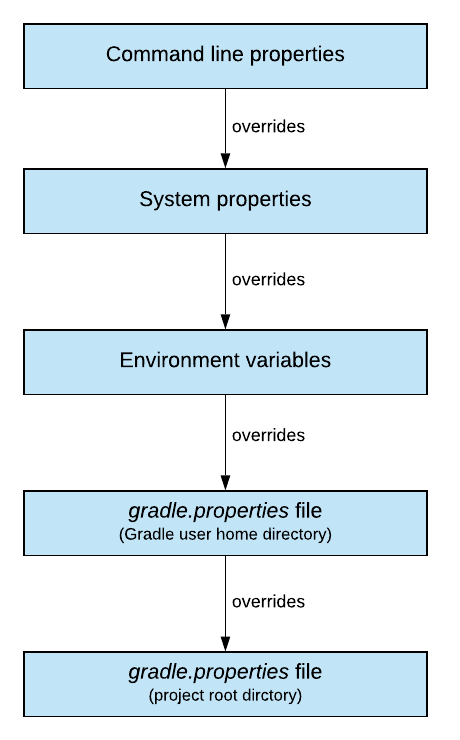
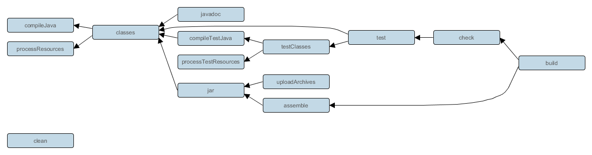
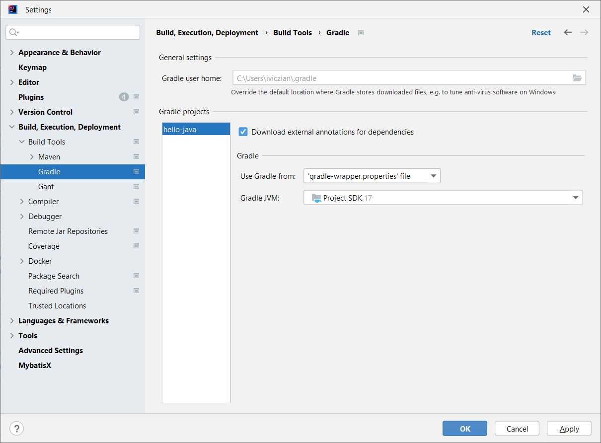

class: inverse, center, middle

# Java projektek Gradle-lel

---

## Gradle jellemzői

* Incremental compilation
* Incremental build
* Több programozási nyelv és platform támogatása
* Dependency management, repository kezelés
* Multimodule
* Profiles (különböző artifact különböző környezetekre?)
* Bővíthetőség: plugin
* Artifact release és deploy (repo-ba)

---

## Maven vs. Gradle

https://gradle.org/maven-vs-gradle/

https://www.jetbrains.com/lp/devecosystem-2023/java/

* Maven
  * De facto standard, szélesebb körben elterjedt
  * Nehéz testreszabni
  * Létező legjobb gyakorlatok
* Gradle
  * Nagyobb flexibilitás
  * Inkrementális build, csak a megváltozott osztályokat fordítja le újra
    * Ennek megfelelően bizonyos taskokat is képes átugorni
    * Multimodule projekteknél is működik: partial build
  * Nagyra növő multimodule projektekhez
  * Groovy DSL tömörebb, mint az XML

---

class: inverse, center, middle

# Első Gradle task

---

## Gradle tulajdonságok

* Groovy-based DSL
* Taskok gráfja (DAG - directed acyclic graph)
* Sok konvenció megegyezik a Mavennel, de flexibilisebben

---

## Gradle felépítés

* Alapfogalma a _project_ melynek építőelemei a _task_-ok
* Hogy ne kelljen a taskokat újra megírni és másolgatni, vannak a pluginok
  * [Java plugin](https://docs.gradle.org/current/userguide/java_plugin.html)

---

## Gradle API


---

## Gradle telepítés

* Kicsomagolni
* `PATH` módosítása

```shell
gradle -v
```

---

## Gradle Script alapok

* Ritkán van rá szükség, csak megértéshez és kiterjesztéshez
* Projekt főkönyvtárában `build.gradle` fájl

```groovy
tasks.register('hello') {
  group 'Demo'
  description 'Prints a welcome message.'
  doLast {
    println 'Hello world!'
  }
}
```

https://docs.gradle.org/current/javadoc/index.html

https://groovy-lang.org/style-guide.html

---

## Gradle futtatás

Futtatás:


```shell
gradlew -q hello
```

Taskok listázása:

```shell
gradlew tasks 
```

---

class: inverse, center, middle

# Gradle HTTP proxy

---

## Gradle HTTP proxy

https://docs.gradle.org/current/userguide/networking.html

---

class: inverse, center, middle

# User home directory

---

## Átállítása

* Alapértelmezett: `%HOME%\.gradle`
* `GRADLE_USER_HOME` környezeti változó, vagy `--gradle-user-home` parancssori paraméter

---

## Gradle properties



---

class: inverse, center, middle

# Gradle wrapper

---

## Gradle wrapper

* Nem kell a gépen telepíteni Gradle-t
* Képes párhuzamosan több Gradle verziót kezelni
* `gradle/wrapper/gradle-wrapper.jar` - tölti le a fájlt
* `gradle/wrapper/gradle-wrapper.properties` - tartalmazza a verziószámot
  * Reprodukálható build

---

## Parancsok

Wrapper létrehozása

```shell
gradle wrapper
```

Windows esetén a következő könyvtárba: `%HOME%\.gradle`

Gradle verzió frissítése:

```shell
gradlew wrapper --gradle-version 6.8.3
```

A `gradlew` futtatható legyen:

```shell
git update-index --chmod=+x gradlew
```

---

class: inverse, center, middle

# További taskok és közöttük lévő függőségek

---


## Task függőségek

```groovy
tasks.register('hello') {
* dependsOn tasks.intro
  group 'Demo'
  description 'Prints a welcome message.'
  doLast {
    println 'Hello world!'
  }
}

tasks.register('intro') {
    doLast {
        println "I'm Gradle"
    }
}
```

String-ek megadása aposztrófokkal (`'`), nincs interpoláció

---

## Default task

```groovy
*defaultTasks 'hello'

tasks.register('hello') {  
  dependsOn tasks.intro
  group 'Demo'
  description 'Prints a welcome message.'
  doLast {
    println 'Hello world!'
  }
}

tasks.register('intro') {
    doLast {
        println "I'm Gradle"
    }
}
```

```shell
gradlew -q
```

https://docs.gradle.org/current/userguide/tutorial_using_tasks.html

---

## Task függőségek felderítése

```shell
gradlew hello --dry-run
```

---

class: inverse, center, middle

# Egyszerű Java projekt

---

## Plugins

* Eltérni a konvencióktól nem szerencsés
* Biztos szükség van egyedi fejlesztésre?
  * _Not invented here_

---

## Gradle plugins

https://plugins.gradle.org/

https://docs.gradle.org/current/userguide/java_plugin.html

---

## Legegyszerűbb build.gradle fájl

```groovy
plugins {
   id 'java'
}
```

* Forrásfájl a `src/main/java` könyvtárban
* `gradle build`

---

## Lifecycle

Nincs, csak plugin szinten



---

## Futtatás

```shell
gradle build
gradle clean build
gradle jar
gradle --console=plain build
```

---

## Gradle daemon

```shell
gradlew --status
gradlew --stop
```

---

## Java version

```groovy
java {
  sourceCompatibility = JavaVersion.VERSION_21
  targetCompatibility = JavaVersion.VERSION_21
}
```

https://docs.gradle.org/current/javadoc/org/gradle/api/JavaVersion.html

* Helyette Java toolchain használatos, mely beállítja ezeket
* Detects locally installed JVMs
* If no matching JVM is found, it will automatically download a matching JDK from AdoptOpenJDK
* https://docs.gradle.org/current/userguide/toolchains.html
* https://kordamp.org/enforcer-gradle-plugin/

Megtalált JDK-k listázása:

```shell
gradle -q javaToolchains
```

```groovy
java {
    toolchain {
        languageVersion = JavaLanguageVersion.of(17)
    }
}
```

---

## Fordító paraméterek

```groovy
tasks.withType(JavaCompile) {
    options.compilerArgs += ["-Adagger.floatingBindsMethods=enabled"]
}
```

---

## JavaDoc

```shell
gradle javadoc
```

---

## Encoding

```groovy
/**
 * 1st approach: Setting encoding during compilation in Java and Test classes
 */
compileJava.options.encoding = "UTF-8"
compileTestJava.options.encoding = "UTF-8"

/**
 * 2nd approach: Setting encoding during compilation in Java and Test classes
 *
tasks.withType(JavaCompile).configureEach() {
	options.encoding = "UTF-8"
}

tasks.withType(JavaExec).configureEach() {
	options.encoding = "UTF-8"
}


tasks.withType(Test).configureEach() {
	systemProperty "file.encoding", "UTF-8"
}

tasks.withType(Javadoc).configureEach() {
    options.encoding = 'UTF-8'
}
 */
```

Globálisan:

https://docs.gradle.org/current/userguide/common_caching_problems.html#system_file_encoding

`gradle.properties` fájlban

```conf
org.gradle.jvmargs=-Dfile.encoding=UTF-8
```

---

class: inverse, center, middle

# Futtatás


---

## Alkalmazás futtatása

```groovy
task runApp(type: JavaExec) {
  classpath = sourceSets.main.runtimeClasspath

  mainClass = 'hello.Hello'
}
```

---

class: inverse, center, middle

# IDEA

---

## IDEA-ban



---

class: inverse, center, middle

# Gradle init

---

## Új alkalmazás létrehozása

`gradle init`

* Varázsló

---

## Létező Maven alkalmazás migrálása

Maven projekt létrehozása:

`mvn archetype:generate -DgroupId=training -DartifactId=hello-maven -DarchetypeArtifactId=maven-archetype-quickstart -Dpackage=hello -DinteractiveMode=false`

Gradle migráció:

`gradle init`

* Varázsló

---

class: inverse, center, middle

# Resources

---

## Resources

* `src/main/resources` könyvtár

---

class: inverse, center, middle

# Függőségek

---

## Új függőség

* GAV koordináták: groupID, artifactID, version
* [Semantic versioning](https://semver.org/)


```groovy
dependencies {
    implementation "com.google.zxing:javase:3.5.0"
}

repositories {
    mavenCentral()
}
```

---

## Dependency configuration

* A függőségek _dependency configuration_-ökbe vannak szervezve, [részletesen](https://docs.gradle.org/current/userguide/java_plugin.html#sec:java_plugin_and_dependency_management)

* compileOnly — for dependencies that are necessary to compile your production code but shouldn’t be part of the runtime classpath
* implementation (supersedes compile) — used for compilation and runtime
* runtimeOnly (supersedes runtime) — only used at runtime, not for compilation
* testCompileOnly — same as compileOnly except it’s for the tests
* testImplementation — test equivalent of implementation
* testRuntimeOnly — test equivalent of runtimeOnly

---

## Alternatív megadási mód

```groovy
implementation group: 'com.google.zxing', name: 'javase', version: '3.5.0'
```

---

## Függőség intervallumok

* Nem javasolt
* Nem reprodukálható build
* Manuálisan

---

## Tranzitív függőségek, függőségi fa


```shell
# Függőségi fa listázása
gradlew -q dependencies
```

Függőségek könyvtára: `~/.gradle/caches/modules-2/files-2.1`

---

## Függőségek elemzése

https://github.com/gradle-dependency-analyze/gradle-dependency-analyze

```groovy
plugins {
  id "ca.cutterslade.analyze" version "1.10.0"
}
```

```shell
gradle analyzeClassesDependencies
```

---

## Ismétlés megszüntetése

```groovy
dependencies {
    def zxingVersion = '3.5.0'
    implementation "com.google.zxing:core:${zxingVersion}"
    implementation "com.google.zxing:javase:${zxingVersion}"

    def lombokVersion = '1.18.24'
    compileOnly "org.projectlombok:lombok:${lombokVersion}"
    annotationProcessor "org.projectlombok:lombok:${lombokVersion}"
}
```

Stringek megadása idézőjelekkel (`"`), interpoláció

---

## Lombok

```groovy
def lombokVersion = "1.18.34"
compileOnly "org.projectlombok:lombok:${lombokVersion}"
annotationProcessor "org.projectlombok:lombok:${lombokVersion}"
```

---

## Gradle Versions Plugin

* [Gradle Versions Plugin](https://github.com/ben-manes/gradle-versions-plugin)

```groovy
plugins {
  id 'com.github.ben-manes.versions' version '0.38.0'
}
```

```shell
gradlew dependencyUpdates
```

---

## Overriding transitive dependency versions

```groovy
dependencies {
    implementation 'org.apache.httpcomponents:httpclient:4.5.4'
    implementation('commons-codec:commons-codec') {
        version {
            strictly '1.9'
        }
    }
}
```

---

## Excluding transitive dependencies

```groovy
dependencies {
    implementation('commons-beanutils:commons-beanutils:1.9.4') {
        exclude group: 'commons-collections', module: 'commons-collections'
    }
}
```

---

## JAR hell futás időben

* [JHades](http://jhades.github.io/)
* `ClassNotFoundException` / `NoClassDefFoundError` kivételek megjelenésekor
* Az alkalmazás működik az egyik környezetben, de nem működik a másikon
* Az alkalmazás működik az egyik alkalmazásszerveren, de nem működik a másikon
* Ha módosítasz az alkalmazáson, és redeploy után nem látod a módosítást
* Ha az alkalmazás nem működik új függőség bevezetésekor, vagy egy függőség verziójának megváltoztatásakor

---

class: inverse, center, middle

# Tesztesetek

---

## Tesztesetek

```groovy
repositories {
	mavenCentral()
}

test {
    useJUnitPlatform()
}

dependencies {
    testImplementation 'org.junit.jupiter:junit-jupiter-api:5.9.1'
    testRuntimeOnly 'org.junit.jupiter:junit-jupiter-engine:5.9.1'
}
```

---

## Kiíratás

```shell
gradle test -i
```

Plugin:

```groovy
plugins {
    id 'com.adarshr.test-logger' version '3.2.0'
}
```

---

## Szűrés

```groovy
test {
    useJUnitPlatform {
    	includeTags 'fast'
      excludeTags 'slow'
    }
}
```

## Tesztek átugrása

`-x` vagy `--exclude-task` parancssori paraméterrel

```shell
gradlew build -x test
```

---

class: inverse, center, middle

# Tesztlefedettség Jacocoval

---

## Tesztlefedettség

https://docs.gradle.org/current/userguide/jacoco_plugin.html

```groovy
plugins {
  id 'jacoco'
}

test {
  useJUnitPlatform()
  finalizedBy jacocoTestReport
}

jacoco {
  toolVersion = "0.8.12"
}

jacocoTestReport {
  dependsOn test // tests are required to run before generating the report
}

```

---

class: inverse, center, middle

# SonarQube

---

## SonarQube indítása

```shell
docker run --name sonarqube -d -p 9000:9000 sonarqube:lts
```

* `admin`/`admin` -> `admin` / `admin12AA`
* My Account / Security / Generate Tokens

## Gradle integráció

https://docs.sonarqube.org/latest/analysis/scan/sonarscanner-for-gradle/

```groovy
plugins {
    id "org.sonarqube" version "3.1.1"
}
```

```groovy
sonar {
    properties {
        property "sonar.projectName", "employees"
        property "sonar.projectKey", "training:employees"
        property "sonar.jacoco.xmlReportPath", "${project.buildDir}/reports/jacoco/test/jacocoTestReport.xml"
        property "sonar.login", "token"
    }
}
```

---

## Futtatás

```shell
./gradlew sonarqube 
```

---

## Jacoco report feltöltése

```groovy
jacocoTestReport {
  dependsOn test // tests are required to run before generating the report
  reports {
        xml.required = true
    }
}
```

---

class: inverse, center, middle

## Csomagolás

---

## Futtatható JAR állomány készítése


```groovy
jar {
    manifest {
        attributes 'Main-Class': 'hello.Hello'
    }
}
```

---

## Függőségek odamásolása

```groovy
task copyDependencies(type: Copy) {
  from configurations.compileClasspath
  into 'build/dependencies'
}
```

```shell
gradlew copyDependencies
```

---

class: inverse, center, middle

# Docker image készítése

---

## Csomagolás Docker Image-be Dockerfile használatával Gradle projekt esetén - gyakorlat

`Dockerfile` fájl tartalma:

```dockerfile
FROM eclipse-temurin:17
WORKDIR /app
COPY build/libs/employees-gradle-1.0.0.jar employees.jar
CMD ["java", "-jar", "employees.jar"]
```

```shell
docker build -t employees .
```

```shell
docker run -d --name employees-gradle -p 8081:8080 employees-gradle
docker logs -f employees-gradle
```

## Docker layers Gradle esetén

```shell
mkdir tmp
cd tmp
java -Djarmode=layertools -jar ..\build\libs\employees-gradle-1.0.0.jar extract
```

`Dockerfile.layered` tartalma:
  
```dockerfile
FROM eclipse-temurin:17 as builder
WORKDIR /app
COPY build/libs/employees-gradle-1.0.0.jar employees.jar
RUN java -Djarmode=layertools -jar employees.jar extract

FROM eclipse-temurin:17
WORKDIR /app
COPY --from=builder app/dependencies/ ./
COPY --from=builder app/spring-boot-loader/ ./
COPY --from=builder app/snapshot-dependencies/ ./
COPY --from=builder app/application/ ./
ENTRYPOINT ["java", "org.springframework.boot.loader.JarLauncher"]
```

```shell
docker build --file Dockerfile.layered  -t employees-gradle .  
```

* `EmployeesWebController` módosítása

```java
log.debug("List employees");
```

```shell
gradlew clean bootJar
```

---

class: inverse, center, middle

# Multi-project build

---

## Multi-project build

* Funkciónként
* Rétegenként
* Monolit, de modularizált alkalmazásoknál
  * Jól definiált függőségek, míg nem volt Java Platform Module System
* Egyben buildelhető, release-elhető
  * Párhuzamosság
* Microservice-ek esetén jelentőségét vesztette
* Nagyon meg kell gondolni, hogy szükség van-e rá


---

## Multi-project build and integration tests

The JVM Test Suite Plugin https://docs.gradle.org/current/userguide/jvm_test_suite_plugin.html#jvm_test_suite_plugin
Közös konfiguráció subprojectekre: https://stackoverflow.com/questions/55402064/gradle-multi-project-integration-tests-with-junit5
Pluginnel: https://docs.gradle.org/current/samples/sample_jvm_multi_project_with_additional_test_types.html

---

class: inverse, center, middle

# Lib fejlesztése

---

## Java application vagy library

* `java-library` plugin library fejlesztéshez
* API és implementáció különválasztásához

https://docs.gradle.org/current/userguide/java_library_plugin.html

---

class: inverse, center, middle

# Nexus

---

## Nexus elindítása

```shell
docker run -d -p 8081:8081 -p 8082:8082 --name nexus sonatype/nexus3
```

```shell
docker exec -it nexus cat /nexus-data/admin.password
```

---

## Nexus proxy-ként (globális)

A `~/.gradle/init.gradle` fájl tartalma:

```groovy
allprojects {
  ext.RepoConfigurator = {
    maven {
      url = uri('http://localhost:8091/repository/maven-public/') 
      allowInsecureProtocol true
    }
  }
  buildscript.repositories RepoConfigurator
  repositories RepoConfigurator
}
```

* Gradle 7-től kezdődően https-en kéne, `allowInsecureProtocol` konfig kikapcsolja ennek ellenőrzését

---

## Nexus proxy-ként (lokális)

```groovy
repositories {
   maven {
    url "http://localhost:8091/repository/maven-public/"
    allowInsecureProtocol true
  }
}
```

---

## Deploy to Nexus 

.small-code-14[
```groovy
plugins {
    id 'maven-publish'
}

publishing {
    publications {
        bootJava(MavenPublication) {
            artifact bootJar
        }
    }
    repositories {
        maven {
            def nexusUrl = findProperty('nexusUrl') ?: 'http://localhost:8091'
            def releasesRepoUrl = nexusUrl + "/repository/maven-releases/"
            def snapshotsRepoUrl = nexusUrl + "/repository/maven-snapshots/"
            url = version.endsWith('SNAPSHOT') ? snapshotsRepoUrl : releasesRepoUrl
            credentials {
                username findProperty('nexusUsername') ?: 'admin'
                password findProperty('nexusPassword') ?: 'admin'
            }
            allowInsecureProtocol true
        }
    }
}
```
]

```shell
gradlew bootJar publish
```

---

## Docker repository létrehozása Nexus-ban

* Create Docker hosted repository (port `8082`)
* Adminisztrációs felületen: _Security / Realms_ tabon: _Docker Bearer Token Realm_ hozzáadása

---

## Docker image deploy Nexus-ba Gradle-lel - gyakorlat

```shell
docker tag employees-gradle localhost:8092/employees-gradle
docker login localhost:8092
docker push localhost:8092/employees-gradle
```

---

class: inverse, center, middle

## Jakarta EE alkalmazás Gradle-lel

---

https://start.jakarta.ee/

* Gradle nem válaszható: https://github.com/eclipse-ee4j/starter/issues/94

```groovy
gradle init
```

```groovy
plugins {
    id 'java'
    id 'war'
}

dependencies {
    compileOnly 'jakarta.platform:jakarta.jakartaee-api:10.0.0'
}

group = 'training'
version = '0.1-SNAPSHOT'
description = 'jakartaee-hello-world'

java {
    toolchain {
        languageVersion = JavaLanguageVersion.of(22)
    }
}

tasks.withType(JavaCompile) {
    options.encoding = 'UTF-8'
}

repositories {
    mavenCentral()
}
```

```shell
gradlew build
```

```shell
bin\standalone.bat
```

Elérhető a `http://localhost:8080/jakartaee-hello-world-0.1-SNAPSHOT/rest/hello` címen

```shell
gradlew -q dependencies
```

---

## Deploy

* Nincs WildFly Gradle Plugin
* Gradle Cargo Plugin - már nem fejlesztik: https://github.com/bmuschko/gradle-cargo-plugin

```groovy
task deploy (dependsOn: war, type: Copy) {
    from 'build/libs/'
    into 'C:/java/wildfly-33.0.1.Final/standalone/deployments'
    include '*.war'
}
```

---

## Deploy paraméterezve

`gradle.properties`

```conf
wildflyLocation=C:/temp
```

`%HOME%\.gradle\gradle.properties`

```conf
wildflyLocation=C:/java/wildfly-33.0.1.Final/standalone/deployments
```

```groovy
task deploy (dependsOn: war, type: Copy) {
    from "build/libs/"
    into project.findProperty('wildflyLocation')
    include "*.war"
}
```
